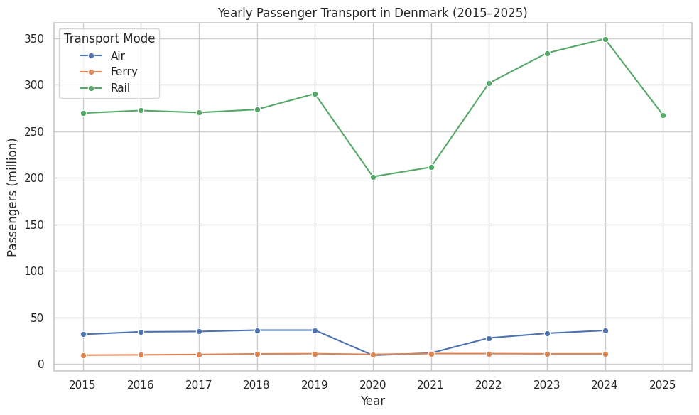

# Passenger Transport Trends in Denmark (2015–2025)

This project analyzes long-term trends in passenger transport in Denmark across three major modes:
- 🚆 Rail
- ⛴ Ferry
- ✈️ Air

The goal is to clean, harmonize, and analyze real-world public statistics data and visualize how passenger volumes have evolved over time.

---

## 📊 Data Sources

All datasets are publicly available statistics from **Statistics Denmark (StatBank)**:

- Rail passenger transport (quarterly data)
- Ferry passenger transport (yearly data)
- Air passenger transport (yearly data)

The raw CSV files use StatBank’s export format, which includes:
- Non-standard separators (`;`)
- Multiple header and metadata rows
- Missing or placeholder values

Handling this structure is part of the analysis.

---

## 🧹 Data Processing

The following steps were performed:

1. Manual parsing of StatBank CSV files using Python’s `csv` module
2. Extraction of correct header rows and data rows
3. Conversion of quarterly data into yearly totals
4. Safe handling of missing or non-numeric values (`NaN`)
5. Standardization of all datasets into a tidy format:

## year | passengers_million | mode
6. Merging rail, ferry, and air datasets into a single dataset

The final cleaned dataset is saved as:

data/all_transport_yearly.csv

---

## 📈 Analysis & Visualization

The analysis notebook includes:
- Line plots showing long-term trends by transport mode
- Comparison of passenger volumes across rail, ferry, and air
- Identification of disruptions and recovery patterns (e.g. COVID-19 impact)

Plots are created using `matplotlib` and `seaborn`.

---

## 📁 Repository Structure

├── data/
│ ├── all_transport_yearly.csv
│ └── raw StatBank CSV files
├── notebooks/
│ └── analysis.ipynb
├── README.md
---

## ▶️ How to Run

1. Open the notebook:
notebooks/analysis.ipynb2. 
2. Install required packages if needed:
```python
pip install pandas matplotlib seaborn
```
3. Run the notebook cells in order to reproduce the analysis.
## 🧠 Notes

This project intentionally uses real, messy data to reflect realistic data science workflows.

Some years contain missing values for certain transport modes due to data availability.

The focus is on data cleaning, reasoning, and reproducibility rather than perfect datasets.
## Key Findings

Passenger volumes across rail, ferry, and air transport show a sharp decline in 2020, corresponding to COVID-19 restrictions.

Air travel experienced the strongest relative drop, while rail recovered faster post-2021.

By 2023–2024, all modes show recovery trends, though air travel exceeds pre-pandemic levels more slowly.
## Visualization Discussion

The line plot compares yearly passenger volumes for rail, ferry, and air transport in Denmark.

A clear structural break is visible in 2020, reflecting the impact of COVID-19 travel restrictions. The gradual recovery from 2021 onward differs by transport mode, highlighting varying resilience across sectors.
##  Data Limitations

Rail data is aggregated from quarterly statistics, while ferry and air data are yearly totals.

The analysis does not distinguish between domestic and international passengers.

Passenger numbers are aggregated nationally and do not reflect regional variation.
## Reproducibility

All processed datasets are saved in the data/processed/ directory.
The analysis can be reproduced by running the notebook from top to bottom after installing the listed dependencies.
## Future Work

Extend the analysis with monthly or route-level data

Compare Denmark with other Nordic countries

Investigate correlations with fuel prices or policy 
## Skills Demonstrated

- Data cleaning and reshaping with pandas
- Working with real-world public datasets
- Time-series aggregation (quarterly → yearly)
- Exploratory data analysis and visualization
- Clear documentation and reproducible analysis
